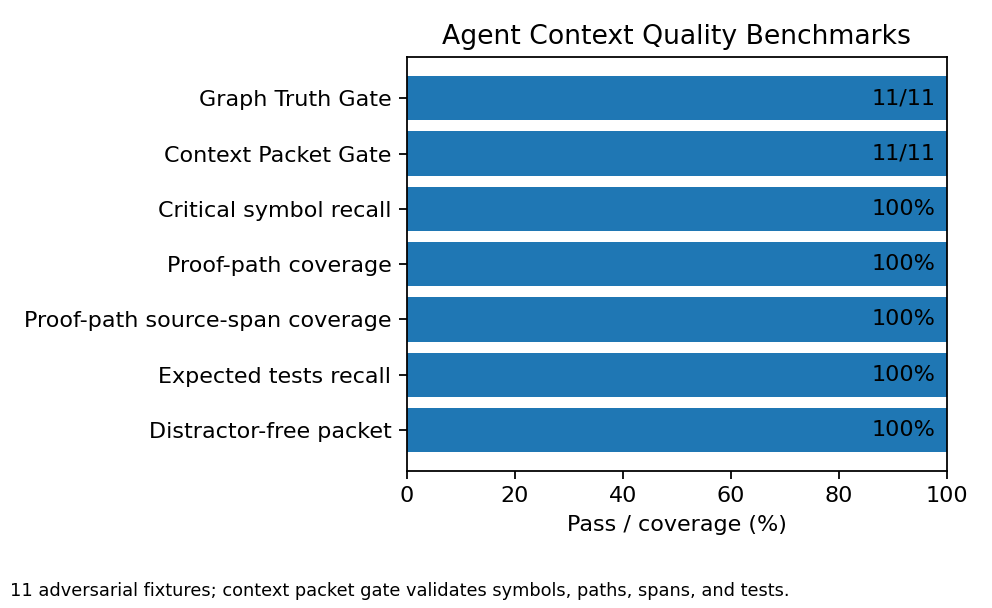
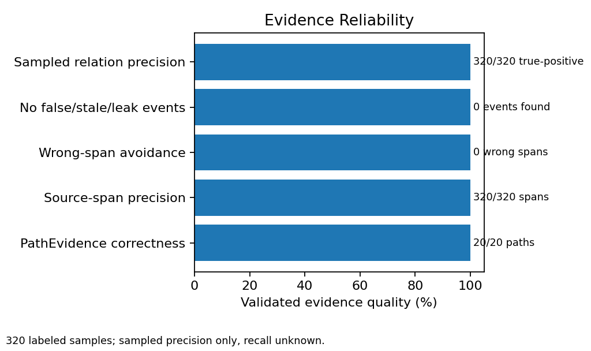
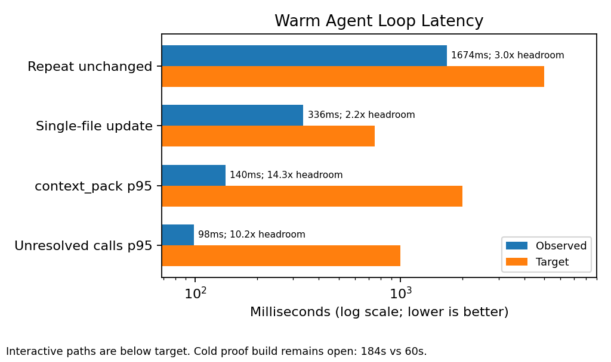

# CodeGraph MCP

Local code-graph evidence layer for AI coding agents.

CodeGraph MCP indexes a repository into a deterministic typed program graph,
verifies facts against source spans and provenance, and returns compact context
packets that a coding agent can actually trust.

## Agent-impact benchmarks

| Agent Context Quality | Trusted Proof Relations | Agent Loop Readiness |
|---|---|---|
|  |  |  |

Current status: semantic proof and context-packet gates are green, compact
proof storage is under the intended 250 MiB target, and stale or mismatched DB
reuse is guarded by DB passport preflight. The remaining intended-tool blocker
is cold proof-build time; CGC comparison remains diagnostic/incomplete, with no
superiority claim.

See: [Intended Tool Quality Gate](reports/final/intended_tool_quality_gate.md)
and [Manual Relation Precision](reports/final/manual_relation_precision.md).

```text
repository
  -> typed program graph
  -> exact graph/source verification
  -> compact evidence packet
  -> grounded model edits
```

## Why It Exists

Coding agents are strongest when they have current, compact, verifiable project
memory. They are weakest when they have to infer APIs, schemas, call paths, data
flow, tests, or security behavior from scattered text search results.

Embeddings, BM25, binary signatures, and ranking help find candidates quickly.
They do not prove correctness. Final context should come from graph facts,
exactness labels, source spans, provenance, and stored path evidence.

## What It Does

- Indexes a local repository into a typed program graph.
- Tracks entities, calls, reads, writes, flows, mutations, tests, mocks,
  assertions, auth checks, source spans, and provenance where extractor support
  exists.
- Separates exact proof facts from heuristic/debug evidence.
- Builds context packets around verified paths instead of shallow text
  retrieval.
- Exposes the graph through a CLI, local MCP server, and loopback Proof-Path UI.

## Current Evidence

The latest comprehensive benchmark publishes the gates below, with correctness,
context quality, warm-operation latency, and update performance passing.

| Gate | Current result | Status |
|---|---|---|
| Graph Truth fixtures | 11 / 11 passed | pass |
| Context Packet fixtures | 11 / 11 passed | pass |
| Forbidden edge/path hits | 0 | pass |
| Proof source-span coverage | 100% | pass |
| Exact-labeled unresolved facts | 0 | pass |
| Derived facts without provenance | 0 | pass |
| Test/mock production leakage | 0 | pass |
| DB integrity | ok | pass |
| Repeat unchanged index | 1.674s | pass |
| Single-file update | 336ms | pass |
| context_pack p95 | 852ms | pass |
| Unresolved-calls page p95 | 243ms | pass |
| Proof DB size | 171.184 MiB vs 250 MiB target | pass |
| Cold proof build | 184,297 ms vs 60s target | open |
| CodeGraphContext comparison | CGC timed out | incomplete |

Cold proof-build time is the main intended-tool blocker. Compact proof storage
now passes the 250 MiB target, while comprehensive reports may still flag
storage-efficiency stretch metrics such as proof DB stretch size or bytes per
proof edge. This README does not claim final intended-performance readiness.

## CodeGraph vs CodeGraphContext

A fair comparison needs both systems to complete comparable indexing and query
artifacts.

| Comparison item | Result |
|---|---|
| CGC available | yes, version 0.4.7 |
| CGC completed current comparable run | no |
| CGC timeout | yes |
| CodeGraph vs CGC speed | unknown |
| CodeGraph vs CGC storage | unknown |
| CodeGraph vs CGC quality | unknown |
| Verdict | incomplete |

CGC timed out on the comparable indexing run at version 0.4.7. A clean
head-to-head requires CGC to complete; until then this is not reported as a
CodeGraph win. CodeGraph internal gates are tracked separately from competitor
claims. A timeout, skipped run, partial DB, or fake-agent dry run is not counted
as superiority evidence.

## Quickstart

Build:

```bash
cargo build --workspace
```

Index this repository from a checkout:

```bash
cargo run --bin codegraph-mcp -- index .
```

Query evidence with a symbol that exists in this repo:

```bash
cargo run --bin codegraph-mcp -- query symbols index_repo_to_db
cargo run --bin codegraph-mcp -- context-pack --task "Trace indexing entry point" --seed index_repo_to_db --budget 1600
```

If `codegraph-mcp` is installed on your `PATH`, replace
`cargo run --bin codegraph-mcp --` with `codegraph-mcp`.

For the full CLI surface, see [docs/cli-reference.md](docs/cli-reference.md).

## Architecture

CodeGraph is split into three practical layers:

- **Extract and store:** parse source files, assign stable identities, record
  source spans, and persist exact/heuristic facts in SQLite.
- **Verify and rank:** use retrieval only to suggest candidates, then verify
  graph paths, exactness, provenance, and production/test/mock context.
- **Package evidence:** return compact context packets with proof paths,
  snippets, expected tests, and labels a coding agent can use.

The retrieval funnel is:

```text
exact seeds, symbols, BM25, current files
  -> binary/vector candidate narrowing
  -> compressed rerank
  -> exact graph/path verification
  -> proof-oriented context packet
```

## Language Support

Tree-sitter extraction spans 13 languages including TS/JS, Python, Go, Rust,
Java, C/C++, C#, Ruby, and PHP, with relation support varying by language and
extractor. See [docs/language-frontends.md](docs/language-frontends.md) for the
tiered support matrix, exactness labels, and known limitations.

## Interfaces

- `codegraph-mcp index` builds the local graph.
- `codegraph-mcp index` uses DB passport preflight: valid matching DBs can
  reuse incrementally, while stale, mismatched, corrupt, or unknown default DBs
  are rebuilt safely instead of silently reused.
- `codegraph-mcp query ...` searches symbols, text, relations, paths, callers,
  callees, impact, and unresolved calls.
- `codegraph-mcp context-pack ...` emits agent-facing proof context.
- `codegraph-mcp serve-mcp` exposes local read-mostly MCP tools.
- `codegraph-mcp serve-ui` opens the local Proof-Path UI.
- `codegraph-mcp bench comprehensive` writes the master correctness, context,
  storage, latency, update, and comparison gate.

## Platform Support

| Platform | Current status | Verification path |
|---|---|---|
| Windows | Supported and tested. | PowerShell fresh-clone and index smoke scripts. |
| Linux via Docker | Supported and tested path. | `Dockerfile` plus `scripts/smoke_docker.sh`; requires a running Docker daemon and normal dependency resolution. |
| WSL2 | Supported path. | Use the Linux scripts inside an Ubuntu or Debian WSL2 distro, preferably from the WSL filesystem. |
| macOS | Coming soon. | Not currently tested, no CI coverage, and not claimed as supported. |

Native Linux with Cargo uses the same Bash scripts as WSL2. macOS support is
planned, not currently tested, and not covered by CI.

## Fresh Clone Verification

Fresh-clone smoke scripts copy the current workspace into a temporary directory
with spaces in the path where possible, then run metadata, build, test, and help
checks without CGC, Autoresearch, or external benchmark artifacts.

Windows:

```powershell
powershell -NoProfile -ExecutionPolicy Bypass -File .\scripts\smoke_fresh_clone.ps1
```

Linux, WSL2, or Git Bash:

```bash
./scripts/smoke_fresh_clone.sh
```

Logs are written under `reports/smoke/fresh_clone/`.

## Index Smoke

The deterministic fixture lives at
[fixtures/smoke/basic_repo](fixtures/smoke/basic_repo). It contains one
supported source file, one function, one caller, and its own README.

Windows:

```powershell
powershell -NoProfile -ExecutionPolicy Bypass -File .\scripts\smoke_index.ps1
```

Linux, WSL2, or Git Bash:

```bash
./scripts/smoke_index.sh
```

The fixture index is the mandatory CI-sized smoke. Full-repo `index .` is a
local-only smoke by default because it is larger and may be too slow for CI.
Under `CI=true`, pass `-RunRepoIndex` on PowerShell or `--run-repo-index` on
Bash when a full local repo index is intentionally desired.

Logs are written under `reports/smoke/index/`.

## Reports

Benchmark and audit artifacts:

- [reports/final/comprehensive_benchmark_latest.md](reports/final/comprehensive_benchmark_latest.md) and [reports/final/comprehensive_benchmark_latest.json](reports/final/comprehensive_benchmark_latest.json) - latest preserved comprehensive gate.
- [reports/final/compact_proof_db_gate.md](reports/final/compact_proof_db_gate.md) and [reports/final/compact_proof_db_gate.json](reports/final/compact_proof_db_gate.json) - compact proof DB gate.
- [reports/comparison/codegraph_vs_cgc_latest.md](reports/comparison/codegraph_vs_cgc_latest.md) and [reports/comparison/codegraph_vs_cgc_latest.json](reports/comparison/codegraph_vs_cgc_latest.json) - latest CGC comparison status, normalized from the public `CODEGRAPH_VS_CGC_LATEST.*` label for case-sensitive link checks.
- [reports/final/pr_baseline_status.md](reports/final/pr_baseline_status.md) and [reports/final/pr_baseline_status.json](reports/final/pr_baseline_status.json) - PR-readiness baseline status.
- [reports/final/intended_tool_quality_gate.md](reports/final/intended_tool_quality_gate.md) and [reports/final/intended_tool_quality_gate.json](reports/final/intended_tool_quality_gate.json) - Intended Tool Quality Gate.
- [reports/final/manual_relation_precision.md](reports/final/manual_relation_precision.md) and [reports/final/manual_relation_precision.json](reports/final/manual_relation_precision.json) - manual sampled precision boundary.
- [docs/architecture.md](docs/architecture.md) - architecture details.
- [docs/benchmark-guide.md](docs/benchmark-guide.md) - benchmark workflow.
- [docs/mcp-reference.md](docs/mcp-reference.md) - MCP tools and schemas.
- [docs/language-frontends.md](docs/language-frontends.md) - language frontend coverage.
- [docs/guardrails.md](docs/guardrails.md) - implementation boundaries and retrieval funnel contract.
- [docs/cli-reference.md](docs/cli-reference.md) - CLI commands, flags, and output behavior.
- [docs/codegraphcontext-comparison.md](docs/codegraphcontext-comparison.md) - black-box CGC comparison setup and fairness rules.
- [docs/quality-gates.md](docs/quality-gates.md) - local checks, CI expectations, and smoke coverage.
- [docs/quickstart.md](docs/quickstart.md) - short build, index, query, MCP, watcher, UI, and benchmark walkthrough.
- [docs/install.md](docs/install.md) - install paths, dry runs, release metadata, and distribution targets.
- [docs/troubleshooting.md](docs/troubleshooting.md) - common indexing, SQLite, UI, MCP, watcher, and benchmark issues.
- [reports/audit/README.md](reports/audit/README.md) - audit report contract and historical audit report index.

Generated raw DBs, raw CGC outputs, and run-specific evidence directories are
not treated as permanent README targets. Regenerate them when needed.

## Manual Precision Status

Manual precision evidence is sampled precision only:

- 320 labeled samples total.
- Recall is unknown because there is no false-negative gold denominator.
- There is no precision claim for absent proof-mode relations, including
  `AUTHORIZES`, `CHECKS_ROLE`, `SANITIZES`, `EXPOSES`, `TESTS`, `ASSERTS`,
  `MOCKS`, and `STUBS`.

## Known Limitations

- Intended Tool Quality Gate verdict is `FAIL`.
- The current preserved failure is `proof_build_only_ms = 184,297 ms`, above the
  `<=60,000 ms` target.
- Compact proof storage passes the intended 250 MiB target, but comprehensive
  storage-efficiency stretch metrics may still fail.
- This README does not claim final intended-performance pass.
- CGC comparison is diagnostic, blocked, and incomplete.
- No CodeGraph vs CGC superiority claim is made.
- Manual precision is sampled precision only; recall is unknown.
- macOS is coming soon, not currently tested, has no CI coverage, and is not
  supported by this baseline.
- Full-repo indexing is local-only smoke unless a CI job explicitly opts into it.

## How to Regenerate Reports

The README links stable Markdown/JSON summaries. Heavy raw DBs, raw CGC outputs,
and run-specific evidence directories should be regenerated instead of becoming
README targets.

Useful regeneration commands:

```powershell
cargo run --bin codegraph-mcp -- bench comprehensive --fresh --output-dir reports\final
cargo run --bin codegraph-mcp -- bench cgc-comparison --output-dir reports\comparison --timeout-ms 180000 --top-k 10
cargo run --bin codegraph-mcp -- audit summarize-labels --dir reports\final\artifacts --json reports\final\manual_relation_precision.json --markdown reports\final\manual_relation_precision.md
```

CGC comparison remains optional and diagnostic unless all official comparison
preconditions are met. Missing competitor data must stay `unknown` or `skipped`.

## How to Run CI Checks Locally

Run the core build and test gates:

```powershell
cargo build --workspace
cargo test --workspace
```

Run README and link checks:

```powershell
python scripts\check_readme_artifacts.py
python scripts\check_markdown_links.py
```

Run smoke checks:

```powershell
powershell -NoProfile -ExecutionPolicy Bypass -File .\scripts\smoke_fresh_clone.ps1
powershell -NoProfile -ExecutionPolicy Bypass -File .\scripts\smoke_index.ps1
```

On Linux, WSL2, or Git Bash:

```bash
./scripts/smoke_fresh_clone.sh
./scripts/smoke_index.sh
./scripts/smoke_docker.sh
```

Docker smoke requires Docker Desktop or a Linux Docker daemon to be running.

## Safety and Scope

- Local first: graph state is written under `.codegraph/`.
- Read-mostly MCP: source-editing and destructive tools are not exposed.
- Exact graph first: retrieval shortcuts cannot prove facts by themselves.
- Single-agent workflow: this project is designed for one linear Codex-style
  coding agent, not parallel subagent delegation.
- Honest measurement: unsupported, skipped, unavailable, or diagnostic data
  stays `unknown`, `skipped`, or `diagnostic`.
