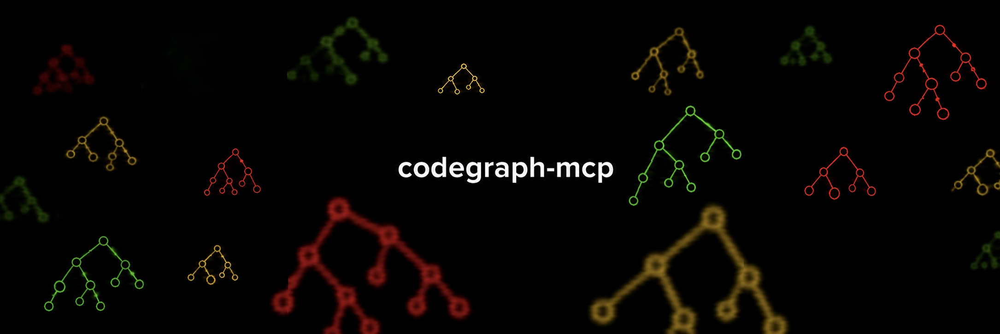
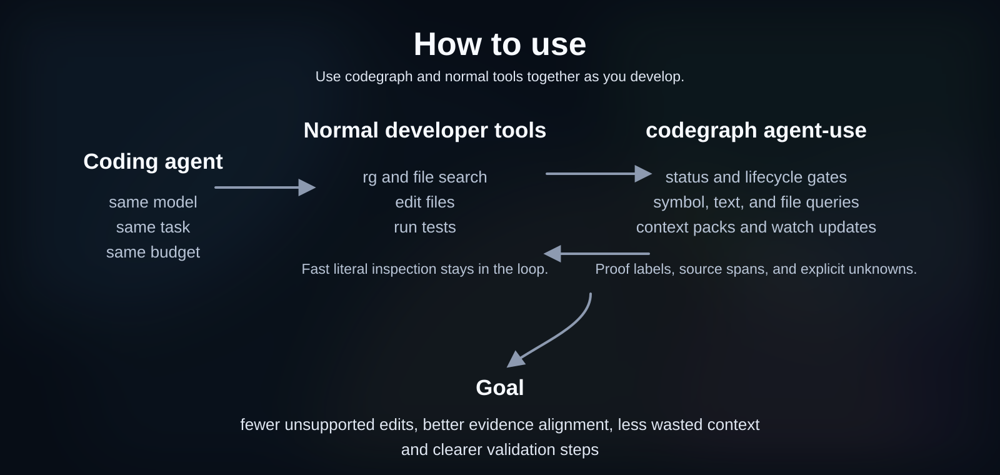
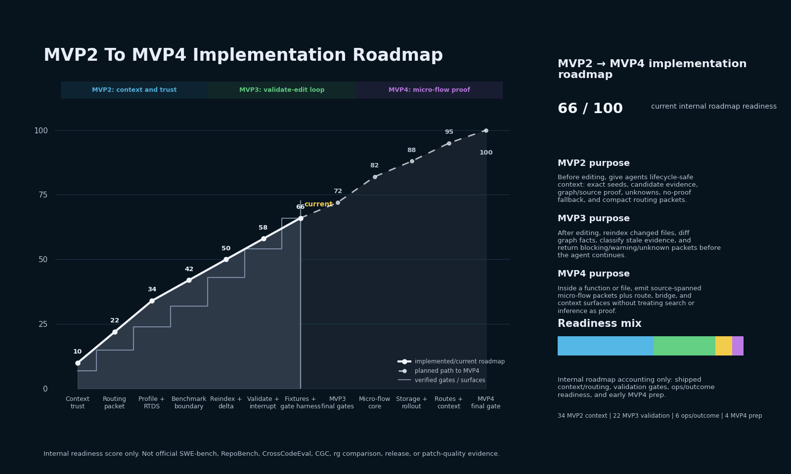
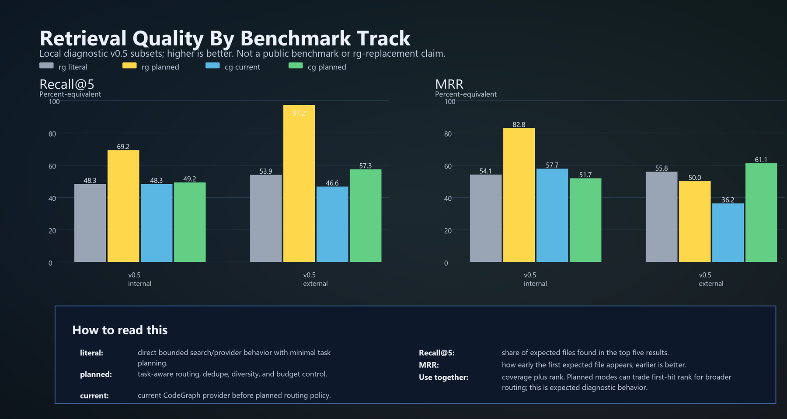
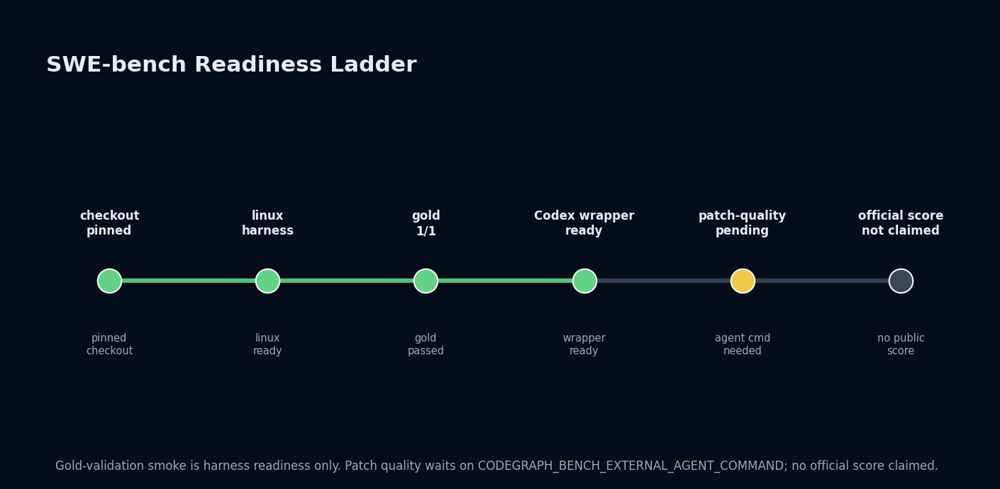
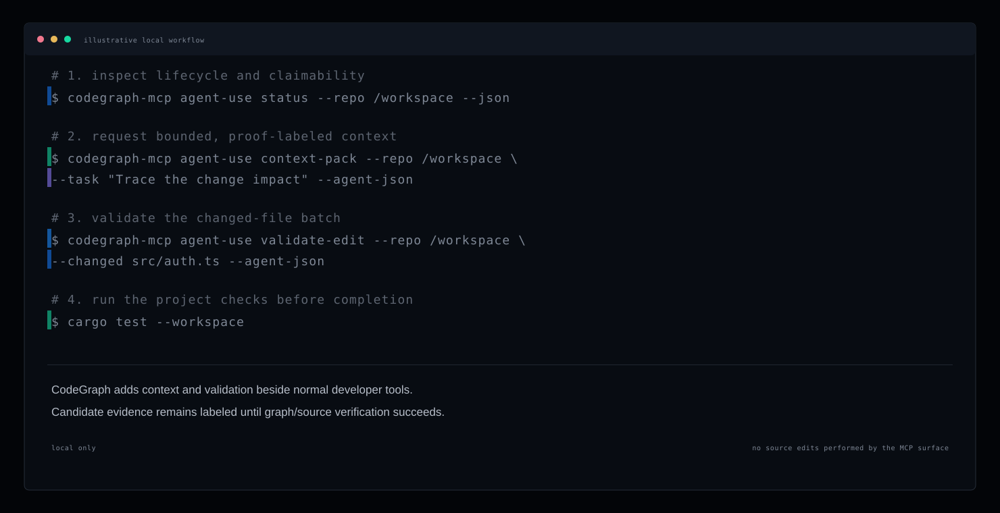

# codegraph-mcp

[](https://github.com/Cameloo1/codegraph-mcp/actions/workflows/ci.yml)
[](LICENSE)
[](docs/quickstart.md)

Local, proof-grounded repo context for AI coding agents.

An agent-native repo context layer, developed with AI assistance and built for
developer-directed coding agents.

codegraph-mcp indexes a repository into a deterministic typed program graph,
checks graph reads against lifecycle state and source spans, and returns compact
context packets that a coding agent can inspect instead of guessing. Retrieval
lanes can suggest likely files or symbols, but typed graph/source verification
is the only path to graph proof.

## Start Here

| Need | Go to |
|---|---|
| Build and run the first commands | [Quickstart](docs/quickstart.md) |
| Use CodeGraph with a coding agent | [Agent Use](docs/agent-use.md) |
| Understand the architecture and proof model | [Architecture Notes](docs/architecture.md) |
| Understand benchmark and evidence boundaries | [Agent Benchmarking](docs/agent-benchmarking.md) |
| Contribute safely | [Contributing](CONTRIBUTING.md) |

## Current Status

| Surface | Current behavior |
|---|---|
| Production agent profile | `agent-use` resolves a release-binary profile with the DB outside the source tree. |
| Status and recovery | `agent-use status` is read-only and returns lifecycle blockers plus recovery commands. |
| Indexing | `agent-use index` is the first mutating production-profile command. |
| Query and context | `agent-use query` and `agent-use context-pack` read the same external profile DB and emit bounded agent JSON. |
| Change tracking | `agent-use watch --once --changed` updates an existing safe profile DB; persistent watch schedules the same update primitive. |
| Evidence boundary | Candidate, vector, text, and source-navigation evidence remain non-proof unless graph/source verification proves the relation. |
| MCP | `agent-use mcp-config` emits a read-mostly MCP config tied to the external profile DB. |

## Product Shape



| Roadmap To MVP4 | Retrieval Quality | SWE-bench Readiness |
|---|---|---|
|  |  |  |

These visuals summarize local diagnostic readiness and benchmark-lab evidence
only. They are not official SWE-bench, RepoBench, CrossCodeEval, CGC, or `rg`
comparison results.

CodeGraph is meant to improve agent reliability **on top of normal developer
tools**. `rg`, file search, editing, and tests stay available. CodeGraph adds an
explicit repo map, lifecycle-checked graph reads, compact context packets,
source spans, proof labels, candidate-only labels, and recovery commands.

The product question is not whether CodeGraph replaces `rg`. It is whether the
same coding agent, with the same task and budget, makes fewer wrong edits and
better-supported plans when CodeGraph is available alongside normal tools.

## Quickstart



Build:

```bash
cargo build --workspace
```

Index this repository from a checkout:

```bash
cargo run --bin codegraph-mcp -- index .
```

Query evidence with a symbol that exists in this repo:

```bash
cargo run --bin codegraph-mcp -- query symbols index_repo_to_db
cargo run --bin codegraph-mcp -- context-pack \
    --task "Trace indexing entry point" \
    --seed index_repo_to_db \
    --budget 1600
```

If `codegraph-mcp` is on your `PATH`, drop the
`cargo run --bin codegraph-mcp --` prefix. Full CLI surface:
[docs/cli-reference.md](docs/cli-reference.md).

For a coding-agent loop, use the production profile:

```bash
cargo build --release --bin codegraph-mcp
codegraph-mcp agent-use status --repo <repo> --json
codegraph-mcp agent-use index --repo <repo> --json
codegraph-mcp agent-use watch --repo <repo> --once --changed src/file.ts --json
codegraph-mcp agent-use query symbols <symbol> --repo <repo> --limit 5 --agent-json
codegraph-mcp agent-use context-pack --repo <repo> \
    --task "Trace the change impact" \
    --agent-json
codegraph-mcp agent-use mcp-config --repo <repo> --json
```

The `agent-use` namespace is the production agent profile: status checks are
read-only, indexing is explicit, and the profile DB is kept outside the source
tree by default. Use `context-pack --mode test-impact --agent-json` when the
agent explicitly needs test/mock evidence. Production context excludes
test/mock/mixed/unknown evidence by default.

For long-lived agent use, keep the agent-facing index separate from temporary
lab and development databases. See [Agent Use](docs/agent-use.md) and
[Operational Profiles](docs/operational-profiles.md).

## Why It Exists

Coding agents are strongest when they have current, compact, verifiable project
memory. They are weakest when they have to infer APIs, schemas, call paths, data
flow, tests, or security behavior from scattered text search results.

Embeddings, BM25, binary signatures, and ranking help find candidates quickly.
They do not prove correctness. Final context should come from graph facts,
exactness labels, source spans, provenance, and stored path evidence, not from
"top-k similar chunks."

## Evidence Boundary

When reading any CodeGraph output, keep the proof boundary intact:

- Typed graph facts with source spans and a lifecycle-valid DB can support graph
  proof.
- Source-navigation and text evidence can guide inspection, but they do not
  prove typed graph relations.
- Vector, binary, nuance, routing-packet, and candidate-spool lanes route
  attention only until graph/source verification succeeds.
- Local diagnostic benchmark output is useful for development, but it is not a
  public superiority claim.

## Language Support

Tree-sitter extraction covers JavaScript, JSX, TypeScript, TSX, Python, Go,
Rust, Java, C#, C, C++, Ruby, and PHP. Support varies by language and extractor:
JS/TS has the richest relation coverage, Python/Go/Rust have conservative
caller/callee support, and several languages are syntax/entity-first. See
[Language Frontends](docs/language-frontends.md) for the tiered support matrix,
exactness labels, and known limitations.

## Interfaces

- `codegraph-mcp index` - build the local graph.
- `codegraph-mcp query ...` - search symbols, text, files, references,
  definitions, calls, chains, and relation paths.
- `codegraph-mcp impact ...` - inspect impact for a file or symbol.
- `codegraph-mcp context-pack ...` - emit agent-facing proof context.
- `codegraph-mcp serve-mcp` - expose local read-mostly MCP tools.
- `codegraph-mcp serve-ui` - open the local Proof-Path UI.
- `codegraph-mcp agent-use ...` - use the production agent profile with an
  external DB and bounded agent JSON.
- `codegraph-mcp languages` - inspect supported language frontends and proof
  limitations.

Indexing uses DB passport preflight. Valid matching DBs can reuse
incrementally; stale, mismatched, corrupt, or unknown default DBs are rebuilt
safely instead of silently reused.

## Platform Support

| Platform | Status | Verification |
|---|---|---|
| Windows | Supported and tested | PowerShell fresh-clone and index smoke scripts |
| Linux via Docker | Supported and tested | `Dockerfile` and `scripts/smoke_docker.sh`; requires Docker daemon |
| WSL2 | Supported | Use Linux scripts inside an Ubuntu/Debian WSL2 distro |
| macOS | Coming soon | Not currently tested, no CI coverage, not claimed as supported |

## Verification

Core local checks:

```bash
cargo build --workspace
cargo test --workspace
python scripts/check_readme_artifacts.py
python scripts/check_markdown_links.py
python scripts/check_docs_hygiene.py
```

Smoke checks:

```bash
# Linux / WSL2 / Git Bash
./scripts/smoke_fresh_clone.sh
./scripts/smoke_index.sh
./scripts/smoke_docker.sh

# Windows PowerShell
powershell -NoProfile -ExecutionPolicy Bypass -File .\scripts\smoke_fresh_clone.ps1
powershell -NoProfile -ExecutionPolicy Bypass -File .\scripts\smoke_index.ps1
```

The deterministic fixture at [fixtures/smoke/basic_repo](fixtures/smoke/basic_repo)
is the mandatory CI-sized smoke. Full-repo indexing is an explicit opt-in check.

## Contributor Guide

Start with [CONTRIBUTING.md](CONTRIBUTING.md). The short version:

- keep release/product work separate from benchmark/OpenEvolve lab work;
- do not stage generated DBs, raw logs, benchmark payloads, patches,
  predictions, WAL/SHM files, or local run directories;
- preserve the evidence boundary in code, docs, reports, and examples;
- update CLI/MCP docs when command contracts change.

## Known Limitations

- Final intended-performance pass is not claimed.
- Relation coverage varies by language and extractor.
- macOS is coming soon; it is not tested or supported by this baseline.
- Full-repo indexing is an explicit opt-in check, not a default CI smoke.
- `agent-use validate-edit` is deferred to the validation roadmap; current
  context packets and RTDS freshness are not compiler/test replacements.
- Knowledge-graph embeddings such as TransE, RotatE, ComplEx, TuckER,
  hyperbolic relation embeddings, and tensor decomposition are offline research
  directions, not runtime requirements.

## Safety and Scope

- **Local first.** Default CLI graph state is local; production `agent-use`
  graph state lives outside the source tree by default.
- **Read-mostly MCP.** Source-editing and destructive tools are not exposed.
- **Exact graph first.** Retrieval shortcuts cannot prove facts by themselves.
- **Single-agent workflow.** Designed for one linear Codex-style coding agent,
  not parallel subagent delegation.
- **Honest measurement.** Unsupported, skipped, unavailable, or diagnostic data
  stays `unknown`, `skipped`, or `diagnostic`. A timeout or partial run is never
  counted as a win.

## Benchmark Lab

Branch: `benchmark-and-openevolve-lab`.

Docs: [Agent Benchmarking](docs/agent-benchmarking.md),
[Benchmark Guide](docs/benchmark-guide.md), [Benchmark Findings](docs/benchmark-findings.md).

Current lab tracks:

- internal gold retrieval;
- RepoBench smoke and small retrieval runs;
- CrossCodeEval parser/load smoke and retrieval runs;
- SWE-bench Lite gold validation and one-task patch-quality smoke.

Current provider arms: `baseline`, `rg_only`, `codegraph_exact_text`, and
`codegraph_full`.

Patch-quality runs use an external agent command. The local Codex wrapper is
`benchmarks/scripts/run_codex_external_patch_agent.ps1`, configured through
`CODEGRAPH_BENCH_EXTERNAL_AGENT_COMMAND`. It reads benchmark JSON from stdin,
runs Codex in the task workspace, writes only a `diff --git` patch to stdout,
and keeps prompts/logs under ignored benchmark paths.

## OpenEvolve Lab

OpenEvolve is an evolutionary coding loop: an LLM mutates code, an evaluator
scores it, and the run keeps better variants.

For CodeGraph, it is lab-only policy search for retrieval/ranking experiments
on `benchmark-and-openevolve-lab`; outputs are not proof and are not merged
automatically.

## References

<details>
<summary>Research and design references</summary>

The compression and retrieval design draws on published work; the typed-graph
foundation is closer to program-analysis literature than to embedding-only
retrieval.

- Yamaguchi et al., *Modeling and Discovering Vulnerabilities with Code
  Property Graphs* (S&P 2014) - AST + CFG + PDG unified into one graph for
  static analysis.
- Guo et al., *GraphCodeBERT: Pre-training Code Representations with Data Flow*
  (ICLR 2021) - data flow as "where the value comes from" relations between
  variables.
- Jegou, Douze, Schmid, *Product Quantization for Nearest Neighbor Search*
  (TPAMI 2011) - subvector-decomposed codebooks.
- Kusupati et al., *Matryoshka Representation Learning* (NeurIPS 2022) - a
  single embedding usable at multiple prefix dimensions.
- Bordes et al., *TransE* (NeurIPS 2013); Trouillon et al., *ComplEx* (ICML
  2016); Sun et al., *RotatE* (ICLR 2019); Balazevic et al., *TuckER* (EMNLP
  2019) - knowledge-graph embedding families for offline candidate/path prior
  learning.
- Nickel and Kiela, *Poincare Embeddings for Learning Hierarchical
  Representations* (NeurIPS 2017); Balazevic et al., *MuRP* (NeurIPS 2019) -
  hyperbolic embeddings for hierarchy-heavy structure.
- Tishby and Zaslavsky, *Deep Learning and the Information Bottleneck Principle*
  (ITW 2015) - context-packet sizing as a preserve-the-useful-information
  bottleneck.

</details>
