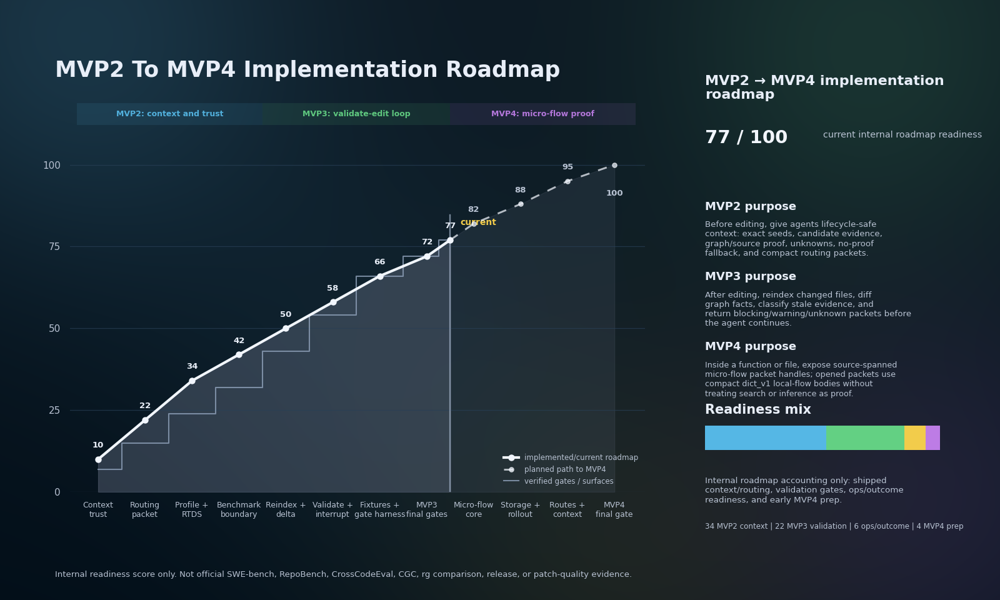

# codegraph-mcp

[](https://github.com/Cameloo1/codegraph-mcp/actions/workflows/ci.yml)
[](LICENSE)
[](docs/quickstart.md)

Local, proof-grounded repo context for AI coding agents.

An agent-native repo context layer, developed with AI assistance and built for
developer-directed coding agents.

codegraph-mcp indexes a repository into a deterministic typed program graph,
checks graph reads against lifecycle state and source spans, and returns compact
context packets that a coding agent can inspect instead of guessing. Retrieval
lanes can suggest likely files or symbols, but typed graph/source verification
is the only path to graph proof.

<table>
<tr>
<td width="50%" valign="top">

<h2>Start Here</h2>

<table>
<thead>
<tr><th>Need</th><th>Go to</th></tr>
</thead>
<tbody>
<tr><td>Build and run the first commands</td><td><a href="docs/quickstart.md">Quickstart</a></td></tr>
<tr><td>Use CodeGraph with a coding agent</td><td><a href="docs/agent-use.md">Agent Use</a></td></tr>
<tr><td>Estimate local DB size and cold/warm timing</td><td><a href="docs/local-footprint.md">Local Footprint</a></td></tr>
<tr><td>Understand the architecture and proof model</td><td><a href="docs/architecture.md">Architecture Notes</a></td></tr>
<tr><td>Understand benchmark and evidence boundaries</td><td><a href="docs/agent-benchmarking.md">Agent Benchmarking</a></td></tr>
<tr><td>Run local edit-guard diagnostics</td><td><a href="docs/agent-reliability-benchmark-lab.md">Agent Guard Playground</a></td></tr>
<tr><td>Contribute safely</td><td><a href="CONTRIBUTING.md">Contributing</a></td></tr>
</tbody>
</table>

</td>
<td width="50%" valign="top">

<h2>Current Status</h2>

<table>
<thead>
<tr><th>Surface</th><th>What it means</th></tr>
</thead>
<tbody>
<tr><td>Agent-use profile</td><td>Keeps the agent-facing DB outside the source tree by default.</td></tr>
<tr><td>Read-only status</td><td>Checks whether repo context is usable before indexing or querying.</td></tr>
<tr><td>Indexing</td><td>Full indexing is manual; real-time delta sync can refresh changed files, and linter-style validation reports blockers, warnings, and unknowns.</td></tr>
<tr><td>Query and context</td><td>Returns compact repo context for planning and inspection.</td></tr>
<tr><td>Edit validation</td><td>Checks changed files after edits and reports blockers, warnings, and unknowns.</td></tr>
<tr><td>MCP setup</td><td>Emits a read-mostly MCP config for agent clients.</td></tr>
</tbody>
</table>

</td>
</tr>
</table>

## Product Shape

<p align="center">
  
</p>

| Roadmap To MVP4 | Retrieval Quality | Local Agent Metrics |
|---|---|---|
|  |  |  |

These visuals summarize local diagnostic readiness and benchmark-lab evidence
only. They are not official SWE-bench, RepoBench, CrossCodeEval, CGC, or `rg`
comparison results.

CodeGraph is meant to improve agent reliability **on top of normal developer
tools**. `rg`, file search, editing, and tests stay available. CodeGraph adds an
explicit repo map, lifecycle-checked graph reads, compact context packets,
source spans, proof labels, candidate-only labels, and recovery commands.

The product question is not whether CodeGraph replaces `rg`. It is whether the
same coding agent, with the same task and budget, makes fewer wrong edits and
better-supported plans when CodeGraph is available alongside normal tools.

## Quickstart

<p align="center">
  
</p>

Build:

```bash
cargo build --workspace
```

Index this repository from a checkout:

```bash
cargo run --bin codegraph-mcp -- index .
```

Query evidence with a symbol that exists in this repo:

```bash
cargo run --bin codegraph-mcp -- query symbols index_repo_to_db
cargo run --bin codegraph-mcp -- context-pack \
    --task "Trace indexing entry point" \
    --seed index_repo_to_db \
    --budget 1600
```

If the locally built `codegraph-mcp` binary is on your `PATH`, drop the
`cargo run --bin codegraph-mcp --` prefix. This checkout is not published as a
`codegraph-mcp` crates.io package; the source build or local path install is the
authoritative setup path for now. Full CLI surface:
[docs/cli-reference.md](docs/cli-reference.md).

For a coding-agent loop, use the production profile:

```bash
cargo build --release --bin codegraph-mcp
codegraph-mcp agent-use status --repo <repo> --json
codegraph-mcp agent-use index --repo <repo> --json
codegraph-mcp agent-use watch --repo <repo> --once --changed src/file.ts --json
codegraph-mcp agent-use validate-edit --repo <repo> --changed src/file.ts --agent-json
codegraph-mcp agent-use query symbols <symbol> --repo <repo> --limit 5 --agent-json
codegraph-mcp agent-use context-pack --repo <repo> \
    --task "Trace the change impact" \
    --agent-json
codegraph-mcp agent-use mcp-config --repo <repo> --json
```

The `agent-use` namespace is the production agent profile: status checks are
read-only, indexing is explicit, and the profile DB is kept outside the source
tree by default. Use `context-pack --mode test-impact --agent-json` when the
agent explicitly needs test/mock evidence. Production context excludes
test/mock/mixed/unknown evidence by default.

Vector/semantic candidate lanes are optional recall aids. They are not learned
production embeddings in this checkout, and they are not graph proof unless a
typed graph/source verification path proves the claim.

For long-lived agent use, keep the agent-facing index separate from temporary
lab and development databases. See [Agent Use](docs/agent-use.md) and
[Operational Profiles](docs/operational-profiles.md).
The full task lifecycle, including when to ask for planning packets, focused
query packets, validate-edit packets, and explain/audit detail, lives in
[Agent Use](docs/agent-use.md#agent-task-lifecycle).

## Measured Local Footprint

These local release-binary measurements use the production `agent-use` profile
with the DB outside the source tree. They are practical size examples, not
public benchmark claims. Cold index is the one-time setup cost for a repo state;
warm reads are the normal agent loop after the profile DB exists.

| Repo / fixture | Source footprint | Files seen / indexed | Graph DB | Cold index | Warm status / query / context |
|---|---:|---:|---:|---:|---:|
| Smoke fixture | 0.52 MB | 3 / 2 | 0.55 MB | 1.07 s | 0.36 s / 0.44 s / 0.35 s |
| codegraph-mcp clean worktree | 11.80 MB | 263 / 181 | 53.11 MB | 71.35 s | 0.79 s / 1.49 s / 1.87 s |

In practice: expect to pay cold index when setting up a repo, after a stale or
missing profile, or after a deliberate full refresh. Once warm, `status`,
focused `query`, and `context-pack` calls are the usable tight-loop operations
for planning, inspection, and validation while the agent continues using normal
search, editing, and tests. Detailed sidecar sizes, read-path timings, method,
and caveats are in [Local Footprint](docs/local-footprint.md).

## Purpose

Coding agents are strongest when they have current, compact, verifiable project
memory. They are weakest when they have to infer APIs, schemas, call paths, data
flow, tests, or security behavior from scattered text search results.

When reading any CodeGraph output, keep the evidence boundary intact:

- Typed graph facts with source spans and a lifecycle-valid DB can support graph
  proof.
- Source-navigation and text evidence can guide inspection, but they do not
  prove typed graph relations.
- Retrieval hints can guide inspection, but they are not proof until
  graph/source verification succeeds.
- Local diagnostic benchmark output is useful for development, but it is not a
  public superiority claim.

## Language Support

Tree-sitter extraction covers JavaScript, JSX, TypeScript, TSX, Python, Go,
Rust, Java, C#, C, C++, Ruby, and PHP. Support varies by language and extractor:
JS/TS has the richest relation coverage, Python/Go/Rust have conservative
caller/callee support, and several languages are syntax/entity-first. See
[Language Frontends](docs/language-frontends.md) for the tiered support matrix,
exactness labels, and known limitations.

## Interfaces

- `codegraph-mcp index` - build the local graph.
- `codegraph-mcp query ...` - search symbols, text, files, references,
  definitions, calls, chains, and relation paths.
- `codegraph-mcp impact ...` - inspect impact for a file or symbol.
- `codegraph-mcp context-pack ...` - emit agent-facing proof context.
- `codegraph-mcp serve-mcp` - expose local read-mostly MCP tools.
- `codegraph-mcp serve-ui` - open the local Proof-Path UI.
- `codegraph-mcp agent-use ...` - use the production agent profile with an
  external DB and budget-aware agent JSON.
- `codegraph-mcp languages` - inspect supported language frontends and proof
  limitations.

Indexing uses DB passport preflight. Valid matching DBs can reuse
incrementally; stale, mismatched, corrupt, or unknown default DBs are rebuilt
safely instead of silently reused.

## Platform Support

| Platform | Status | Verification |
|---|---|---|
| Windows | Supported and tested | PowerShell fresh-clone and index smoke scripts |
| Linux via Docker | Supported and tested | `Dockerfile` and `scripts/smoke_docker.sh`; requires Docker daemon |
| WSL2 | Supported | Use Linux scripts inside an Ubuntu/Debian WSL2 distro |
| macOS | Coming soon | Not currently tested, no CI coverage, not claimed as supported |

## Safety and Scope

- **Local first.** Default CLI graph state is local; production `agent-use`
  graph state lives outside the source tree by default.
- **Read-mostly MCP.** Source-editing and destructive tools are not exposed.
- **Exact graph first.** Retrieval shortcuts cannot prove facts by themselves.
- **Single-agent workflow.** Designed for one linear Codex-style coding agent,
  not parallel subagent delegation.
- **Honest measurement.** Unsupported, skipped, unavailable, or diagnostic data
  stays `unknown`, `skipped`, or `diagnostic`. A timeout or partial run is never
  counted as a win.

## Verification

<details>
<summary>Build, test, and smoke commands</summary>

Core local checks:

```bash
cargo build --workspace
cargo test --workspace
python scripts/check_readme_artifacts.py
python scripts/check_markdown_links.py
python scripts/check_docs_hygiene.py
```

Smoke checks:

```bash
# Linux / WSL2 / Git Bash
./scripts/smoke_fresh_clone.sh
./scripts/smoke_index.sh
./scripts/smoke_docker.sh

# Windows PowerShell
powershell -NoProfile -ExecutionPolicy Bypass -File .\scripts\smoke_fresh_clone.ps1
powershell -NoProfile -ExecutionPolicy Bypass -File .\scripts\smoke_index.ps1
```

The deterministic fixture at [fixtures/smoke/basic_repo](fixtures/smoke/basic_repo)
is the mandatory CI-sized smoke. Full-repo indexing is an explicit opt-in check.

</details>

## Contributor Guide

<details>
<summary>Contributor workflow and hygiene rules</summary>

Start with [CONTRIBUTING.md](CONTRIBUTING.md). The short version:

- keep release/product work separate from benchmark/OpenEvolve lab work;
- do not stage generated DBs, raw logs, benchmark payloads, patches,
  predictions, WAL/SHM files, or local run directories;
- preserve the evidence boundary in code, docs, reports, and examples;
- update CLI/MCP docs when command contracts change.

</details>

## Known Limitations

<details>
<summary>Current boundaries and non-goals</summary>

- Final intended-performance pass is not claimed.
- Relation coverage varies by language and extractor.
- macOS is coming soon; it is not tested or supported by this baseline.
- Full-repo indexing is an explicit opt-in check, not a default CI smoke.
- `agent-use validate-edit` is available as an explicit production-profile
  after-patch validation command; it is not a compiler/test replacement and
  does not imply an editor daemon or plugin.
- Knowledge-graph embeddings such as TransE, RotatE, ComplEx, TuckER,
  hyperbolic relation embeddings, and tensor decomposition are offline research
  directions, not runtime requirements.

</details>

## Benchmark Lab

<details>
<summary>Benchmark lab branch, suites, and external-agent setup</summary>

Branch: `benchmark-and-openevolve-lab`.

Docs: [Agent Benchmarking](docs/agent-benchmarking.md),
[Benchmark Guide](docs/benchmark-guide.md), [Benchmark Findings](docs/benchmark-findings.md),
and [Agent Guard Playground](docs/agent-reliability-benchmark-lab.md).

Current lab tracks:

- internal gold retrieval;
- RepoBench smoke and small retrieval runs;
- CrossCodeEval parser/load smoke and retrieval runs;
- SWE-bench Lite setup/preflight checks and blocked real-agent ladder tracking;
- Agent Guard Playground local diagnostics for bad edits caught, clean edits
  passed, repairs cleared, proof/trust ledger discipline, packet usability, and
  same-agent A/B scaffold invariants.

Current provider arms: `baseline`, `rg_only`, `codegraph_exact_text`, and
`codegraph_full`.

Patch-quality runs use an external agent command. The local Codex wrapper is
`benchmarks/tracks/swebench_lite/scripts/run_codex_external_patch_agent.ps1`,
configured through `CODEGRAPH_BENCH_EXTERNAL_AGENT_COMMAND`. It reads benchmark
JSON from stdin, runs Codex in the task workspace, writes only a `diff --git`
patch to stdout, and keeps prompts/logs under ignored benchmark paths. Current
real-agent patch ladders remain blocked because the external-agent route must be
approved or replaced with a local-only wrapper before provider-visible
task/context payloads are sent. Docker/SWE-bench setup is current-ready after
Docker launch, and a live one-task gold validation passed. A one-task repo-side
preflight with `--skip-agent --skip-eval` is runnable and passed; no
real-agent patch-quality claim is made.

</details>

## OpenEvolve Lab

<details>
<summary>OpenEvolve policy-search lane</summary>

OpenEvolve is an evolutionary coding loop: an LLM mutates code, an evaluator
scores it, and the run keeps better variants.

For CodeGraph, it is lab-only policy search for retrieval/ranking experiments
on `benchmark-and-openevolve-lab`; outputs are not proof and are not merged
automatically.

</details>

## References

<details>
<summary>Research and design references</summary>

The compression and retrieval design draws on published work; the typed-graph
foundation is closer to program-analysis literature than to embedding-only
retrieval.

- Yamaguchi et al., *Modeling and Discovering Vulnerabilities with Code
  Property Graphs* (S&P 2014) - AST + CFG + PDG unified into one graph for
  static analysis.
- Guo et al., *GraphCodeBERT: Pre-training Code Representations with Data Flow*
  (ICLR 2021) - data flow as "where the value comes from" relations between
  variables.
- Jegou, Douze, Schmid, *Product Quantization for Nearest Neighbor Search*
  (TPAMI 2011) - subvector-decomposed codebooks.
- Kusupati et al., *Matryoshka Representation Learning* (NeurIPS 2022) - a
  single embedding usable at multiple prefix dimensions.
- Bordes et al., *TransE* (NeurIPS 2013); Trouillon et al., *ComplEx* (ICML
  2016); Sun et al., *RotatE* (ICLR 2019); Balazevic et al., *TuckER* (EMNLP
  2019) - knowledge-graph embedding families for offline candidate/path prior
  learning.
- Nickel and Kiela, *Poincare Embeddings for Learning Hierarchical
  Representations* (NeurIPS 2017); Balazevic et al., *MuRP* (NeurIPS 2019) -
  hyperbolic embeddings for hierarchy-heavy structure.
- Tishby and Zaslavsky, *Deep Learning and the Information Bottleneck Principle*
  (ITW 2015) - context-packet sizing as a preserve-the-useful-information
  bottleneck.

</details>
