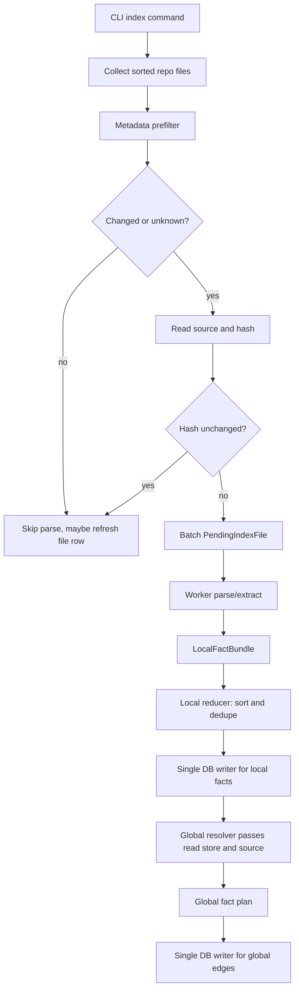
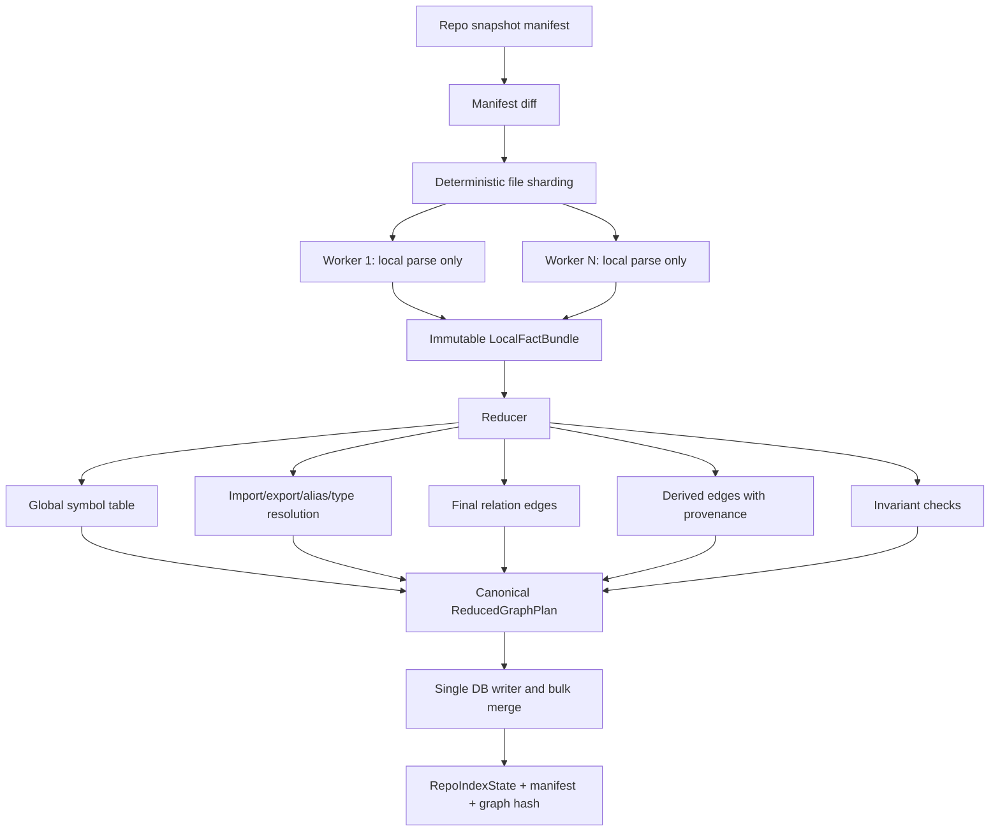

# Incremental Concurrent Indexer Design

Date: 2026-05-10 20:28:22 -05:00

Source of truth read first: `MVP.md`.

Additional inputs read:

- `reports/audit/12_semantic_correctness_gate.md`
- `crates/codegraph-index/src/lib.rs`
- `crates/codegraph-parser/src/lib.rs`
- `crates/codegraph-store/src/sqlite.rs`
- `crates/codegraph-core/src/model.rs`
- CLI index option wiring in `crates/codegraph-cli/src/lib.rs`

## Verdict

Design verdict: proceed with design only.

Implementation readiness: `not yet for optimization`.

The current code can be refactored safely in small, semantics-preserving phases because it already has several useful seams:

- `PendingIndexFile`
- `LocalFactBundle`
- `parse_extract_pending_files`
- `reduce_local_fact_bundles`
- single-store batch persistence
- metadata-first warm skip
- stale delete helpers
- worker-count determinism tests

But the semantic gate from report 12 is still `fail`, so this design must be implemented behind strict graph-truth checks. No smarter storage/index optimization should proceed until either all graph-truth fixtures pass or remaining failures are explicitly unsupported and not proof-grade.

## Current Flow

```text
codegraph-mcp index
  -> resolve repo root and DB path
  -> collect_repo_files(root), sorted
  -> filter ignored and unsupported paths
  -> list current files in DB
  -> delete stale files missing from current path set
  -> for each candidate file:
       -> metadata prefilter using size + modified_unix_nanos + lifecycle metadata
       -> read source when metadata changed or unknown
       -> compute content hash
       -> skip parse when hash unchanged, refresh file row
       -> batch PendingIndexFile
  -> for each batch:
       -> parse_extract_pending_files(batch, workers)
            workers parse local files concurrently
            workers emit LocalFactBundle
       -> reduce_local_fact_bundles
            sorts and dedupes entity/edge IDs
       -> persist_reduced_index_plan
            delete old facts for changed paths
            insert files, entities, snippets, edges
  -> after local writes:
       -> resolve_static_import_edges_for_store
       -> resolve_security_edges_for_store
       -> resolve_test_edges_for_store
  -> write RepoIndexState
```

Current flow diagram:



## Current Gaps

- Workers already emit `LocalFactBundle`, but the bundle still carries full `BasicExtraction`, not a minimal immutable map-output schema.
- Global import/security/test resolution happens after local persistence by rereading the SQLite store and source files.
- Resolver passes are deterministic today through sorted maps and IDs, but they are not modeled as a single reducer over immutable bundles.
- `RepoIndexState` is a summary, not a full repo snapshot manifest.
- `files.metadata_json` stores mtime and lifecycle fields, but not a first-class manifest row with path, size, mtime, hash, language, state, and rename/stale/historical state.
- Rename detection currently exists only in changed-file update via same-hash missing-path cleanup.
- Duplicate file content policy is partly fixed: duplicate contents at different paths preserve distinct file and symbol identity. This must remain.
- Stored PathEvidence is absent in report 12 sampler output. The reducer design must leave a place for generated proof objects, but must not fabricate proof paths during indexing.

## Proposed Flow

Required invariant: workers may parse local files concurrently, but workers must not independently decide global graph truth, write final cross-file edges, create derived edges, or mark proof-grade relations. They emit immutable local observations only.

```text
Index run
  -> RepoSnapshotManifest
  -> ManifestDiff
  -> deterministic shard plan
  -> worker map stage
       -> LocalFactBundle per parsed changed file
  -> reducer stage
       -> global symbol table
       -> import/export/alias resolution
       -> local and cross-file call resolution
       -> security/test relation resolution
       -> derived edge generation with provenance
       -> invariant checks
       -> canonical reduced graph write plan
  -> single controlled DB writer
       -> delete stale paths first
       -> bulk insert current file rows, entities, source spans, edges
       -> insert derived edges only with provenance
       -> update RepoIndexState and manifest
  -> deterministic graph fact hash
       -> compare --workers 1 and --workers N in tests
```

Proposed map/reduce flow:



## Data Structures

### RepoSnapshotManifest

```rust
struct RepoSnapshotManifest {
    repo_id: String,
    repo_root: String,
    repo_commit: Option<String>,
    snapshot_id: String,
    created_at_unix_ms: u64,
    files: Vec<FileSnapshot>,
}
```

### FileSnapshot

```rust
struct FileSnapshot {
    repo_relative_path: String,
    normalized_path: String,
    size_bytes: u64,
    modified_unix_nanos: Option<String>,
    file_hash: Option<String>,
    language: Option<String>,
    indexed_state: IndexedState,
}

enum IndexedState {
    Unknown,
    Current,
    ChangedMetadata,
    ChangedHash,
    Deleted,
    Renamed { from: String },
    Stale,
    Historical,
}
```

Manifest rule: `file_hash` is optional during metadata prefilter. It is filled only for changed or unknown files, or when a policy requires hash verification.

### ManifestDiff

```rust
struct ManifestDiff {
    unchanged: Vec<FileSnapshot>,
    read_and_hash: Vec<FileSnapshot>,
    parse: Vec<FileSnapshot>,
    deletes: Vec<String>,
    renames: Vec<RenameRecord>,
}

struct RenameRecord {
    old_path: String,
    new_path: String,
    file_hash: String,
}
```

### ShardPlan

```rust
struct ShardPlan {
    worker_count: usize,
    shards: Vec<FileShard>,
}

struct FileShard {
    worker_ordinal: usize,
    files: Vec<FileSnapshot>,
}
```

Sharding is deterministic: sort by normalized path, then assign by stable modulo or contiguous chunks. Prefer contiguous chunks for IO locality, but the reducer must produce the same graph fact hash for any worker count.

### LocalFactBundle

The current `LocalFactBundle` in `codegraph-index` is the right seam, but it should be tightened into the map-stage contract:

```rust
struct LocalFactBundle {
    repo_relative_path: String,
    normalized_path: String,
    file_hash: String,
    language: Option<String>,
    size_bytes: u64,
    modified_unix_nanos: Option<String>,
    declarations: Vec<LocalDeclaration>,
    imports: Vec<LocalImport>,
    exports: Vec<LocalExport>,
    local_callsites: Vec<LocalCallSite>,
    local_reads: Vec<LocalRead>,
    local_writes: Vec<LocalWrite>,
    unresolved_references: Vec<LocalReference>,
    source_spans: Vec<SourceSpan>,
    extraction_warnings: Vec<ExtractionWarning>,
}
```

Map-stage allowed facts:

- declarations
- imports
- exports
- local callsites
- local reads/writes
- unresolved references
- exact source spans
- syntax and extraction warnings

Map-stage banned facts:

- final cross-file `CALLS`
- final cross-file `IMPORTS`
- alias target truth
- derived closure edges
- proof-grade labels derived from global resolution
- writes to SQLite

### GlobalSymbolTable

```rust
struct GlobalSymbolTable {
    by_id: BTreeMap<String, SymbolRecord>,
    by_file_export: BTreeMap<(String, ExportName), String>,
    by_qualified_name: BTreeMap<String, Vec<String>>,
    by_local_decl: BTreeMap<(String, String), Vec<String>>,
}
```

Ambiguity is represented explicitly. If a lookup returns multiple candidates and no resolver rule proves a single target, the reducer must emit heuristic/unresolved evidence, not exact proof.

### ReducedGraphPlan

```rust
struct ReducedGraphPlan {
    files_to_delete_first: Vec<String>,
    files_to_upsert: Vec<FileRecord>,
    entities: Vec<Entity>,
    source_spans: Vec<(String, SourceSpan)>,
    base_edges: Vec<Edge>,
    derived_edges: Vec<Edge>,
    path_evidence: Vec<PathEvidence>,
    warnings: Vec<IndexIssue>,
    graph_fact_hash: String,
}
```

All vectors are canonical sorted before write.

## Reducer Responsibilities

The reducer owns all global graph truth:

- Build the global symbol table from declarations and exports.
- Resolve imports, aliases, default exports, named exports, and barrel re-exports.
- Resolve direct local calls to local declarations.
- Resolve named/default/alias imports to imported targets.
- Downgrade unresolved, dynamic, or ambiguous relations to heuristic/unresolved.
- Create final exact `CALLS` only when the target is proven.
- Resolve supported security/test relations using bundle facts and source-span-backed local records.
- Generate derived edges only when provenance edge IDs are known.
- Deduplicate facts by canonical ID and content.
- Reject or downgrade facts that violate proof invariants.
- Produce deterministic warnings for conflicts and unsupported patterns.

The reducer must not depend on SQLite row order. Inputs are sorted before reduction, and output write plans are sorted before persistence.

## Deterministic Ordering Rules

Canonical input order:

1. Normalize path separators to `/`.
2. Sort `FileSnapshot` by normalized repo-relative path.
3. Sort declarations by stable entity ID.
4. Sort imports/exports/calls/reads/writes by `(source_span, local name, relation, text)`.
5. Sort unresolved references by `(source_span, name, reference kind)`.

Canonical reducer order:

1. Symbol table keys are `BTreeMap`/`BTreeSet`.
2. Ambiguous candidate lists sort by stable entity ID.
3. Conflict warnings sort by `(path, category, entity_or_edge_id)`.
4. Entity output sorts by entity ID.
5. Edge output sorts by edge ID.
6. Source spans sort by `(path, start_line, start_column, end_line, end_column)`.
7. PathEvidence sorts by path evidence ID.

DB write order:

1. Delete stale paths sorted ascending.
2. Upsert file rows sorted by path.
3. Insert entities sorted by ID.
4. Insert source spans sorted by ID/span key.
5. Insert base edges sorted by ID.
6. Insert derived edges sorted by ID after base edges.
7. Insert PathEvidence sorted by ID.
8. Update manifest and `RepoIndexState` last.

## Worker-Count Determinism

Worker count must not change output graph truth.

Strategy:

- Workers receive deterministic shards.
- Workers emit immutable local bundles.
- Workers never mutate shared symbol tables.
- Workers never write final graph rows.
- Reducer canonicalizes all map outputs before resolving.
- Global edge IDs derive only from stable semantic inputs, not worker ordinal, parse order, or DB row order.
- A deterministic graph fact hash is computed from canonical graph facts.

Graph fact hash definition:

```text
graph_fact_hash = content_hash(join("\n", sort(canonical_fact_lines)))
```

Canonical fact lines include:

```text
file|path|file_hash|language|size
entity|id|kind|name|qualified_name|path|span|created_from|file_hash
edge|id|head|relation|tail|span|exactness|confidence|class|context|derived|provenance|extractor|file_hash
path|id|source|target|metapath|edge_ids|source_spans|exactness|provenance
```

Test requirement:

- Index the same repo with `--workers 1` and `--workers N`.
- Export canonical fact lines from both DBs.
- Assert identical `graph_fact_hash`.

Small test added in this phase:

- `deterministic_graph_fact_hash_is_order_independent` in `crates/codegraph-index/src/lib.rs`
- Command: `cargo test -q -p codegraph-index deterministic_graph_fact_hash_is_order_independent`
- Result: passed.

Existing related tests already cover:

- `parse_extract_worker_counts_produce_same_local_fact_bundles`
- `full_index_worker_count_determinism_preserves_graph_facts`
- warm unchanged skip behavior
- duplicate file content preserving separate identity
- stale edit/delete/rename/import alias cleanup

## Manifest Diff Strategy

Cold run:

1. Walk repo.
2. Build `FileSnapshot` for each supported file with path, size, mtime, language.
3. Hash all supported files.
4. Mark all as `parse`.
5. Delete stale DB paths not present in snapshot.

Repeat unchanged run:

1. Walk repo and build metadata-only snapshot.
2. Compare path + size + mtime + lifecycle state against stored manifest.
3. If metadata matches current state, skip read, hash, and parse.
4. If metadata differs or manifest is missing, read and hash.
5. If hash matches previous current file at the same path, refresh manifest row and skip parse.
6. If hash differs, parse and replace facts for that path.

Changed run:

1. Normalize changed paths.
2. Delete facts for missing paths.
3. Read and hash existing changed files.
4. Detect same-path unchanged hashes.
5. Parse changed hashes.
6. Re-run reducer over enough impacted files to keep cross-file truth current.

Important reducer implication: changed-file updates cannot only parse the changed file when imports/calls may be affected. The manifest diff must compute an impacted set:

- changed file
- importers of changed file
- re-export barrels involving changed file
- files whose import alias changed
- direct dependents from the previous dependency index

That dependency index can be derived from previous import/export facts and stored as a compact manifest side table later.

## Stale Cleanup Strategy

Stale cleanup remains delete-before-insert for current facts.

For each deleted or changed path:

1. Remove current file row.
2. Remove entities owned by the path.
3. Remove edges whose head, tail, or source span touches the path.
4. Remove source spans for the path.
5. Remove snippet/text index rows for the path.
6. Remove cached PathEvidence touching stale entities/edges.
7. Remove derived edges whose provenance touches stale entities/edges.
8. Write new facts only after cleanup succeeds.

Historical facts may only remain if explicitly versioned by snapshot ID and hidden from current graph truth queries.

## Duplicate File Policy

Duplicate file content at different paths must preserve separate file identity.

Policy:

- Same content hash does not imply same file identity.
- Entity IDs include normalized path, language, kind, qualified name/container, signature where relevant, and declaration fingerprint.
- Duplicate content can share parse/cache artifacts internally, but emitted entities and edges must be re-owned by each path.
- A duplicate parse cache must be path-parametric: source syntax can be reused, but IDs and spans must be rebased to the current path.
- Test mock symbols never overwrite production symbols because path, context, and symbol kind remain part of identity.

Current code already protects this behavior in `duplicate_source_content_keeps_separate_file_and_symbol_identity`; the proposed design must keep that invariant.

## Rename Policy

Rename detection:

- old path missing
- new path present
- same content hash

Behavior:

1. Mark old path as `Renamed { to: new_path }` or delete old current facts.
2. Preserve current graph truth only at the new path.
3. Do not leave old-path entities, edges, source spans, snippets, or derived/path evidence visible.
4. Treat duplicate same-hash files differently from renames: if old path still exists, both paths are current.
5. If old and new path both exist, this is duplicate content, not rename.

Current code has same-hash missing-path cleanup in changed-file updates; full snapshot indexing should promote this to a manifest diff phase so rename behavior is consistent across cold, full, and incremental runs.

## Derived Edges and Provenance

Derived edges are reducer-only.

Required rules:

- A derived edge must have `derived = true`.
- It must use edge class `derived`.
- It must include non-empty provenance edge IDs.
- Its provenance edge IDs must refer to current base or prior derived facts that pass proof validation.
- Closure/transitive edges cannot be counted as raw base facts.
- If provenance is missing, emit a reducer warning and omit or downgrade the edge. Do not write a proof-grade derived edge.

This is directly tied to the current report 12 blocker: `derived_closure_edge_requires_provenance` lacks `src/store.ordersTable`, `WRITES`, `MAY_MUTATE`, and `path://derived/provenance`.

## Single DB Writer

SQLite remains a single controlled writer.

Write plan:

```text
BEGIN IMMEDIATE
  delete stale/current paths
  upsert file rows
  insert/upsert entity rows
  insert source spans/snippets
  insert base edges
  insert derived edges
  insert path evidence
  update manifest
  update repo_index_state
COMMIT
```

For cold bulk indexing, keep the current bulk-load mode that drops/recreates selected indexes, but only around the writer phase. Workers never hold DB write transactions.

For incremental updates, use bounded transactions and avoid dropping indexes.

## Expected Performance Gains

Target performance:

- Autoresearch-scale cold index: <= 60 seconds.
- Repeat unchanged index: <= 5 seconds.
- Single-file update: <= 750 ms p95.
- Worker-count determinism: identical graph fact hash for `--workers 1` and `--workers N`.
- No semantic correctness regression.

Expected gains:

- Cold index: parallel parse/extract keeps CPU cores busy while a single writer amortizes DB overhead. Expected gain comes mainly from parser parallelism and bulk write batching.
- Repeat unchanged index: metadata prefilter avoids reads and hashes for unchanged files. Expected gain is near O(number of files metadata stat calls), not O(total bytes).
- Single-file update: parse only impacted files, then reducer reruns on changed plus dependent set. Expected gain comes from avoiding full repo parse and full resolver store scans.
- DB write: canonical bulk plan improves locality and transaction count without concurrent writers.

Non-goals for this phase:

- No storage compaction.
- No schema shrinking.
- No new vector index optimization.
- No proof weakening to hit speed targets.

## Risk List

| Risk | Mitigation |
| --- | --- |
| Worker race changes graph truth | Workers emit immutable local bundles only; reducer canonicalizes all output. |
| Resolver misses dependents on incremental update | Add impacted-set calculation from import/export dependency facts before enabling fast single-file updates. |
| Duplicate content accidentally shares symbol IDs | Keep path in stable IDs; add duplicate path/content determinism tests to every refactor phase. |
| Rename detection deletes real duplicates | Only treat same hash as rename when old path is missing and new path exists. |
| Metadata prefilter misses file changes due to coarse mtime | If size or mtime unknown/unreliable, hash. Optional periodic hash verification can be added later. |
| Derived edges become proof-grade without provenance | Reducer invariant rejects derived proof edges with empty provenance. |
| Context packet remains broken while indexing gets faster | Semantic gate and context-packet gate must run before claiming optimization readiness. |
| SQLite writer becomes bottleneck | Use canonical bulk write batches and prepared statements before considering storage redesign. |
| Existing store-resolver passes hide nondeterminism | Move resolver logic behind pure reducer inputs and compare graph hashes across worker counts. |

## Implementation Plan

Phase 1: design-only guardrails.

- Keep report 12 gate as a hard blocker for optimization.
- Add deterministic graph fact hash test helper.
- Do not change runtime index semantics.

Phase 2: make manifest diff explicit.

- Add `RepoSnapshotManifest`, `FileSnapshot`, `IndexedState`, and `ManifestDiff`.
- Extract current metadata-first logic from `index_repo_to_db_with_options` into pure helpers.
- Tests:
  - unchanged metadata skips hash.
  - changed metadata requires hash.
  - same hash at same path skips parse.
  - old missing path plus new same hash is rename.
  - same hash at two live paths is duplicate, not rename.

Phase 3: formalize map output.

- Split current `LocalFactBundle` away from full `BasicExtraction`.
- Keep serialization stable for bundle cache/debug artifacts.
- Tests:
  - bundle JSON round trip.
  - exact source spans survive round trip.
  - worker-count local bundle hash identical.

Phase 4: reducer over bundles.

- Build `GlobalSymbolTable` from bundle declarations/imports/exports.
- Move static import/call alias resolution from store-reread pass to reducer.
- Keep existing store-based resolver as a compatibility path until parity is proven.
- Tests:
  - named import.
  - alias import.
  - default import.
  - local shadowing.
  - same-name unimported call stays heuristic.
  - barrel export supported path.

Phase 5: writer plan.

- Introduce `ReducedGraphPlan`.
- Single writer applies delete-before-insert, then sorted file/entity/span/edge/path writes.
- Tests:
  - write plan order is canonical.
  - stale path deleted before new facts.
  - graph fact hash identical for one and many workers.

Phase 6: derived/provenance reducer.

- Add table-like sink detection and persistence/dataflow semantics needed by `derived_closure_edge_requires_provenance`.
- Derived `MAY_MUTATE` is emitted only with provenance edge IDs.
- Tests:
  - `WRITES` base edge exists for supported store fixture.
  - derived `MAY_MUTATE` has provenance.
  - derived without provenance is rejected.
  - graph-truth derived fixture passes.

Phase 7: context packet recovery.

- Persist or reliably generate PathEvidence after reducer proof validation.
- Repair context packet seed resolution so critical graph-truth symbols and proof paths are retrieved.
- Tests:
  - context packet recovers expected critical symbols.
  - proof paths include source spans and snippets.
  - forbidden context symbols excluded.

Phase 8: performance validation.

- Run graph-truth gate and context-packet gate first.
- Run `--workers 1` and `--workers N` graph hash comparison.
- Measure cold, warm, and single-file update timings.
- Only then begin storage/index optimization work.

## Acceptance Mapping

- Design report exists: this file.
- Workers banned from final cross-file truth writes: see Proposed Flow and LocalFactBundle sections.
- `LocalFactBundle` defined: see Data Structures.
- Reducer responsibilities defined: see Reducer Responsibilities.
- Deterministic graph hash defined: see Worker-Count Determinism.
- Intended performance targets defined: see Expected Performance Gains.
- Current code refactor safety stated: safe only in small phases, with semantic gate protection.

## Final Recommendation

Use the current `LocalFactBundle` seam as the bridge, not a rewrite. The safest path is to extract pure manifest and reducer helpers first, prove worker-count graph hashes stay identical, then move existing store-reread resolver behavior into the reducer one relation family at a time.

Do not optimize storage until the semantic blocker from report 12 is fixed and context packets can recover proof paths.
